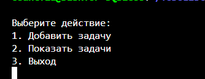

<!DOCTYPE html>
<html>

<body>
    <h1>Органайзер списка задач</h1>
    <h2>Содержание</h2>
    <ol>
        <li><a name="1" href="#1-1">Компилирование</a></li>
        <li><a name="2" href="#2-2">Запуск</a></li>
        <li><a name="3" href="#3-3">Создание архива</a></li>
        <li><a name="4" href="#4-4">Описание 3DViewer</a></li>
        <li><a name="5" href="#5-5">Удаление</a></li>
    </ol>
    <h2>Установка</h2>
    
Чтобы скомпилировать органайзер перейдите в терминале в папку src и выполните команду:

    <pre>make install</pre>
    
Скомпилированный файл будет находиться в папке build под названием <b>ToDoList.class</b>

    <h2>Запуска списка задач</h2>
    
Для использования/запуска вьювера перейдите в терминале в папку build и выполните команду:

    <pre>java ToDoList</pre>
    <h2>Создание архива</h2>
    
Чтобы создать архив органайзера перейдите в терминале в папку src и выполните команду:

    <pre>make dist</pre>
    
В папке src появится файл <b>ToDoList.tar.gz</b>

    <h2>Описание органайзера</h2>
    <ul>
        <li>ToDoList
            
При запуске органайзера печатается главное меню - собственно органайзер:

            
            <ul>
                <li>Органайзер позволяет добавлять задачи в список.</li>
                <li>Органайзер позволяет просматривать созданный список задач.</li>
                <li>Происходит проверка входных параметров на валидность.</li>
            </ul>
        </li>
    </ul>
    <h2>Удаление</h2>
    
Чтобы удалить органайзер перейдите в терминале в папку src и выполните команду:

    <pre>make uninstall</pre>
</body>

</html>